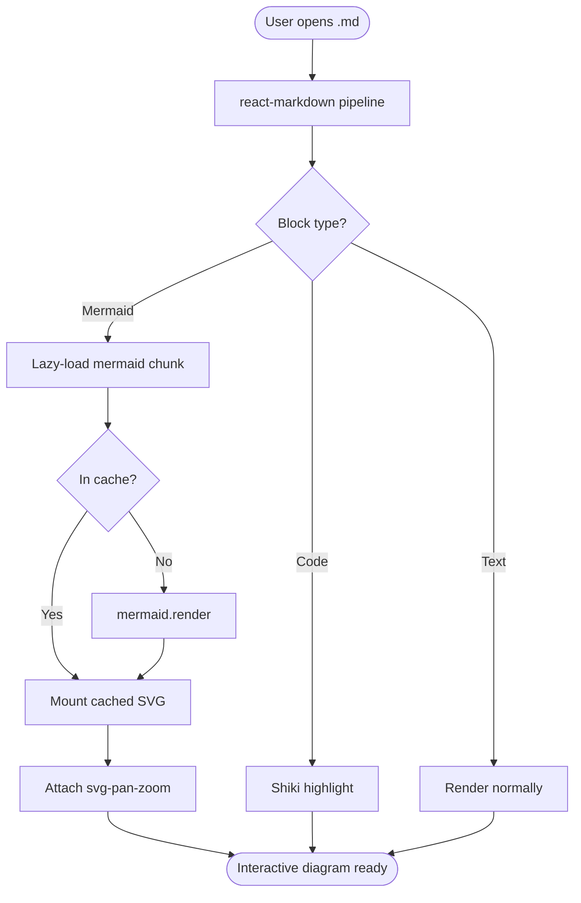
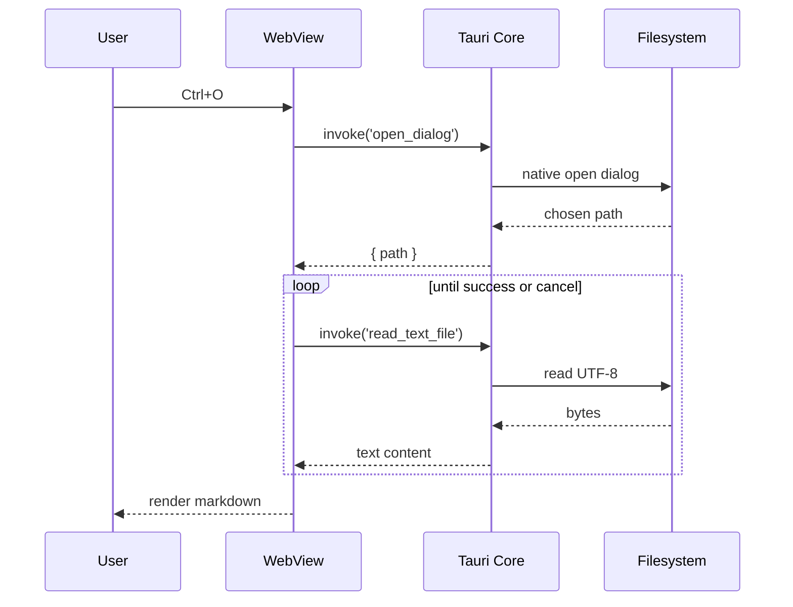
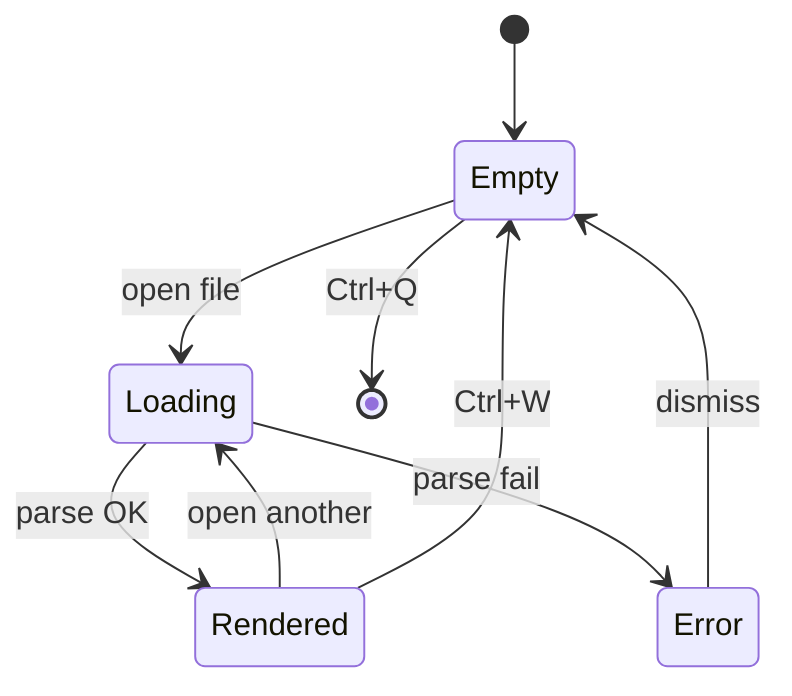
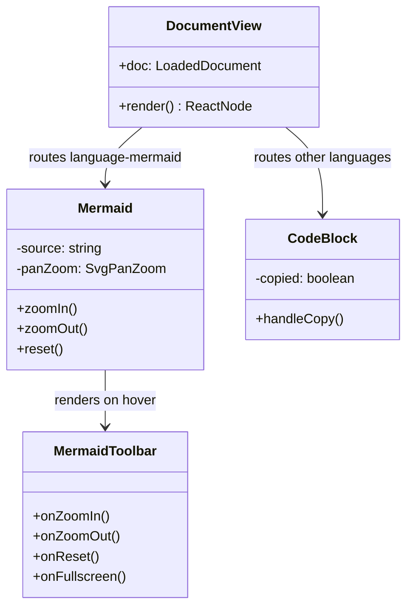

# PR-2 Showcase

This document exercises every feature added in **PR-2** of
`markdown-reader`. Open it in the app to verify the renderer is
behaving end-to-end.

> A single open-action should cover: GFM, math (good and broken),
> code highlight + copy, frontmatter toggle, footnotes, all five
> admonitions, link/image fallbacks, and long-line scroll.

---

## Heading Levels

# Heading 1
## Heading 2
### Heading 3
#### Heading 4
##### Heading 5
###### Heading 6

---

## Inline Formatting

The renderer supports **bold**, *italic*, ***bold italic***,
~~strikethrough~~, `inline code`, and a normal
[link to example.com](https://example.com).

Autolink: <https://github.com/anthropics>.

---

## Lists

Bulleted (with one nested level):

- First bullet
- Second bullet
  - Nested bullet a
  - Nested bullet b
- Third bullet

Numbered (with one nested level):

1. First step
2. Second step
   1. Sub-step a
   2. Sub-step b
3. Third step

---

## Task List (rendered, not interactive)

- [x] Set up Tauri shell (PR-1)
- [x] Wire markdown plugin chain (PR-2)
- [ ] Add Mermaid (PR-3)
- [ ] Build lightbox (PR-4)
- [ ] File ops + persistence (PR-5)

> Verify these checkboxes render but **cannot** be toggled by clicking.

---

## Table (GFM, with column alignment)

| Left aligned | Centered | Right aligned |
| :----------- | :------: | ------------: |
| `node`       | mdast    |        `unified` |
| `react-markdown` | rehype | KaTeX |
| Shiki        | GFM      |       Frontmatter |

---

## Math

Inline: $E = mc^2$, and $a^2 + b^2 = c^2$.

Block:

$$
\int_0^\infty e^{-x}\,dx = 1
$$

Another block:

$$
\sum_{n=1}^{\infty} \frac{1}{n^2} = \frac{\pi^2}{6}
$$

Intentionally broken inline math (must render in red, not crash):
$\frac{1}{$

---

## Footnotes

Here is a sentence with a footnote reference.[^a]

[^a]: This is the footnote body. Forward and back links should both
    work — clicking the marker scrolls to here, and the back-arrow
    returns to the reference.

---

## Admonitions

> [!NOTE]
> Useful information that users should know, even when skimming
> content.

> [!TIP]
> Helpful advice for doing things better or more easily.

> [!WARNING]
> Urgent info that needs immediate user attention to avoid problems.

> [!CAUTION]
> Advises about risks or negative outcomes of certain actions.

> [!IMPORTANT]
> Key information users need to know to achieve their goal.

A regular blockquote (no alert prefix) for comparison:

> "The reasonable man adapts himself to the world; the unreasonable
> one persists in trying to adapt the world to himself."
> — George Bernard Shaw

---

## Code Blocks

TypeScript:

```ts
import { invoke } from '@tauri-apps/api/core';

export interface LoadedDocument {
  path: string;
  text: string;
}

export async function getDataDir(): Promise<string> {
  return invoke<string>('get_data_dir');
}
```

Python:

```python
def fib(n: int) -> int:
    """Return the n-th Fibonacci number."""
    a, b = 0, 1
    for _ in range(n):
        a, b = b, a + b
    return a

print([fib(i) for i in range(10)])
```

Rust:

```rust
fn main() {
    let xs: Vec<i32> = (1..=10).collect();
    let sum: i32 = xs.iter().sum();
    println!("sum of 1..=10 = {sum}");
}
```

Bash:

```bash
#!/usr/bin/env bash
set -euo pipefail
for f in *.md; do
  echo "Processing ${f}..."
  wc -l "${f}"
done
```

JSON:

```json
{
  "name": "markdown-reader",
  "version": "0.1.0",
  "features": ["mermaid", "math", "shiki"],
  "platform": { "os": "windows", "arch": "x64" }
}
```

SQL:

```sql
SELECT u.id, u.name, COUNT(p.id) AS post_count
FROM users u
LEFT JOIN posts p ON p.author_id = u.id
WHERE u.created_at >= '2026-01-01'
GROUP BY u.id, u.name
ORDER BY post_count DESC
LIMIT 20;
```

No language tag (renders plain):

```
plain text without highlighting
- still inside a fenced block
- still gets the Copy button
```

One LONG line to verify horizontal scroll (over 200 chars):

```js
const longString = "This line is intentionally extremely long so we can confirm that the code block scrolls horizontally rather than wrapping or being clipped. It should keep going past the 820px content column boundary.";
```

---

## Images

HTTPS image (should render):


Relative-path image with broken target (should show broken-image; PR-5
will wire local relative paths through `convertFileSrc`):


---

## Horizontal Rule

Above this paragraph there will be a horizontal rule.

---

## Mermaid Diagrams

Hover any diagram to reveal the floating toolbar (top-right). Inside a
diagram: **drag** to pan, **Ctrl + wheel** to zoom (plain wheel scrolls
the page past the block), **double-click** to reset to fit-to-width.
The Fullscreen button is a no-op for now — PR-4 wires the lightbox; for
PR-3 it just logs `fullscreen requested` to the DevTools console.

### Flowchart



### Sequence diagram



### State diagram



### Class diagram



### Intentionally broken diagram (per-block error fallback)

The block below has an incomplete arrow on purpose. It MUST render as a
red-bordered error placeholder, and the four diagrams above MUST keep
rendering normally — verifying R4.5 (per-block try/catch).

```mermaid
graph TD
  A --> B
  C ---
```

---

End of showcase.
